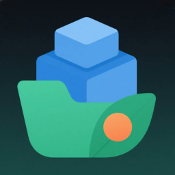
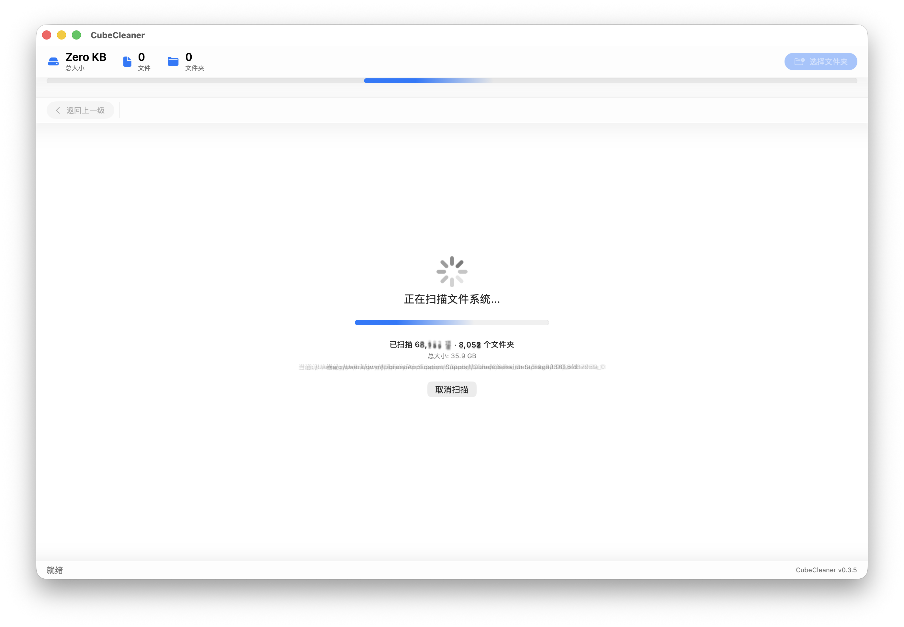
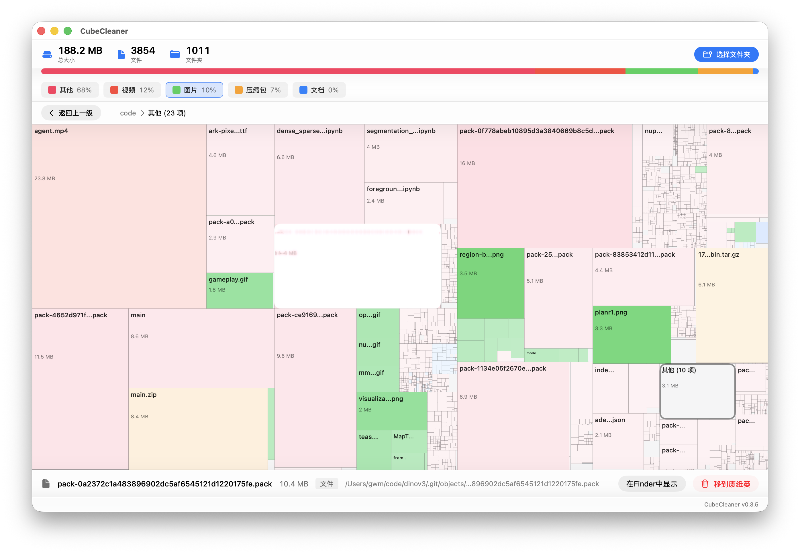

<p align="right">
  <a href="../README.md">English</a> |
  <a href="README-CN.md">简体中文</a>
</p>

<h1 align="center">
  
  <br />
  CubeCleaner
</h1>

<p align="center">
  <em>macOS 磁盘空间可视化工具，用 <strong>TreeMap（矩形树图）</strong>把文件大小画成块——<br />一眼看出谁在占你的硬盘。</em>
</p>

<p align="center">
  <a href="https://github.com/JJLi0427/CubeCleaner/releases">
    
  </a>
  <a href="https://github.com/JJLi0427/CubeCleaner/releases">
    
  </a>
  <a href="../LICENSE">
    
  </a>
  <a href="https://github.com/JJLi0427/CubeCleaner/actions/workflows/release.yml">
    
  </a>
</p>

<p align="center">
  <a href="../assets/screenshot-1.png">
    
  </a>
  <a href="../assets/screenshot-2.png">
    
  </a>
</p>

---

灵感来自 [GrandPerspective](https://apps.apple.com/app/grandperspective/id1111570163)，CubeCleaner 是一个现代 SwiftUI 实现，聚焦扫描性能与原生 macOS 体验。

## 📥 下载

从 [GitHub Releases](https://github.com/JJLi0427/CubeCleaner/releases) 下载最新版本。

> ⚠️ 当前 DMG 为 **ad-hoc 签名**（无 Developer ID、未公证）。在其他 Mac 上首次打开会被 Gatekeeper 拦截，请右键 **CubeCleaner.app** → **打开** → 确认，或拖到 `/Applications` 后运行：
>
> ```bash
> xattr -dr com.apple.quarantine /Applications/CubeCleaner.app
> ```

## ✨ 功能特性

- 🗺️ **TreeMap 可视化** — 矩形面积严格与文件/目录大小成比例，一眼识别空间大户。
- ⚡ **高性能扫描** — 底层调用 `getattrlistbulk` 批量读取文件属性，扫描跑在后台线程、进度节流回写，界面不卡顿。
- 🧩 **小文件聚合** — 小于阈值（父目录总大小 1%）的文件自动归入「其他」块，面积守恒；双击「其他」块可钻取查看内部小文件。
- 🎨 **按类型配色** — 文档 / 图片 / 视频 / 音频 / 压缩包 / 应用 / 系统文件分色显示，同类型内越大的块颜色越深。
- 🖱️ **完整交互** — 单击选中、双击进入子目录、长按在 Finder 中显示、悬停高亮预览。
- 🧭 **面包屑导航** — 顶部显示当前路径，点击任意层级快速跳转，独立「返回上一级」按钮。
- 📊 **实时统计** — 顶部显示总大小 / 文件数 / 文件夹数，附类型占比比例条与可点击高亮的类型图例。
- 🗑️ **移到废纸篓** — 选中项一键移入废纸篓（二次确认，删除后自动重扫）。
- 🧠 **智能边界处理** — 硬链接 / firmlink 去重，符号链接不跟随，跨挂载点子目录不递归，避免大小虚高。
- 🖥️ **原生 Canvas 渲染** — 一次性绘制全部矩形，窗口缩放防抖重算。

## 🚀 快速开始

**环境要求**

- macOS 15.5+
- Xcode 16.0+

**从源码构建**

```bash
git clone https://github.com/JJLi0427/CubeCleaner.git
cd CubeCleaner
open CubeCleaner.xcodeproj
```

在 Xcode 中按 **⌘R** 运行，或使用构建脚本：

```bash
./build.sh build     # Debug 构建
./build.sh release   # Release 构建
./build.sh run       # 运行已构建的 app
```

## 🗂️ 项目结构

```
CubeCleaner/
├── CubeCleaner/                    # 应用源码
│   ├── CubeCleanerApp.swift        # App 入口
│   ├── ContentView.swift           # 主视图（布局编排）
│   ├── DesignSystem.swift          # 设计常量（圆角 / 阴影）
│   ├── Models/                     # 数据模型
│   │   ├── FileSystemItem.swift
│   │   ├── FileSystemError.swift
│   │   ├── FileType.swift
│   │   ├── TreeNode.swift
│   │   └── TreeMapRectangle.swift
│   ├── Services/                   # 扫描 / 布局 / 配色
│   │   ├── BulkFileScanner.swift   # getattrlistbulk 底层扫描
│   │   ├── FileSystemService.swift # 扫描编排（后台线程 + 去重 + 卷边界）
│   │   ├── BinaryTreeMapCalculator.swift  # Squarified TreeMap 布局
│   │   └── ColorSchemeManager.swift       # 类型配色 / 统计
│   ├── Views/                      # SwiftUI 视图
│   │   ├── TreeMapCanvasView.swift
│   │   ├── NavigationBarView.swift / BreadcrumbView.swift
│   │   ├── StatsBarView.swift / TypeRatioBarView.swift / TypeLegendStripView.swift
│   │   ├── BottomDetailBarView.swift
│   │   └── EmptyStateView.swift
│   └── Extensions/
│       └── Array+Chunked.swift
├── CubeCleaner.xcodeproj/          # Xcode 工程
├── build.sh                        # 构建脚本
└── README.md
```

## ⚙️ 技术要点

- **扫描**：`getattrlistbulk` 批量读取 `name / fsid / objtype / fileid / datalength` 属性，`FileManager` 作为失败回退。
- **去重与边界**：`(dev, ino)` 去重硬链接与 firmlink；符号链接标叶子不跟随；`getmntinfo` 预构建挂载点集合，跨卷子目录不递归。
- **布局**：Squarified TreeMap（Bruls/Huijsen/van Wijk 2000）直接优化长宽比，消除细长条。
- **性能**：整树聚合大小在扫描后自底向上缓存一次（`O(1)` 读取）；树节点不挂 `ObservableObject`，刷新由 `rootNode` 一次性驱动。

## 📄 许可证

MIT License © CubeCleaner Contributors。详见 [LICENSE](../LICENSE)。